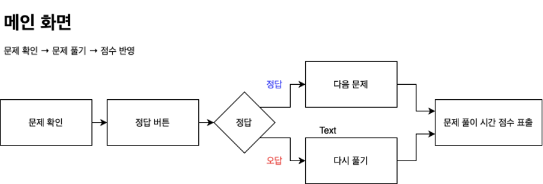
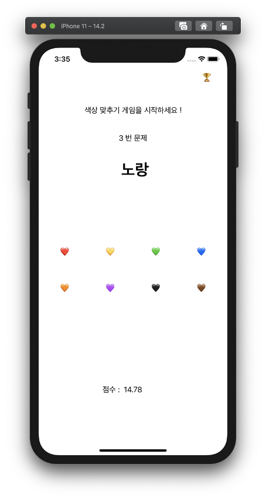
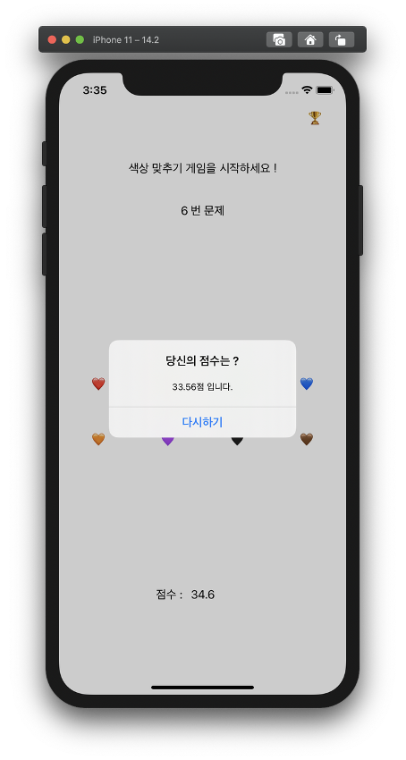
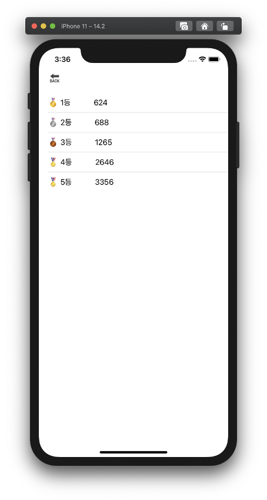

# ColorMatching 기획서
   
## 1. 기능   
* 기능 정의   
   * 단어 랜덤 생성 - 색상을 나타내는 단어와 색상이 랜덤하게 나타내진다.    
   * 정답 클릭 - 색상 수대로 버튼을 표시하고 정답을 맞추면 다음 문제로 넘어간다.   
   * 점수 계산 - 5개의 문제를 푼 시간이 점수로 반영 된다. 즉, 점수가 적을수록 등수가 높아진다.   
   * 순위 계산 - 지금까지의 점수들의 순위표를 적은 수에 따라 정렬된다.   
   
## 2. 서비스 정의 및 목표   
* 목표    
   * 간단한 색상 게임 구현하기   
* 목적   
   * 사고력을 키울 수 있다    
   * 게임을 하면서 흥미를 키울 수 있다    
* 특징   
   * 직관적이고 깔끔한 UI/UX 디자인  
   * 참고 아이디어   
   * AI 면접 적성 검사 게임을 참고   
* 서비스 구조   
   * 문제 확인 → 문제 풀기 → 점수 반영   
    
## 3. Flow chart  
</img>
 
## 4. 와이어 프레임   
</img>
</img>
</img>
 
* 색상을 뜻하는 단어와 단어의 색상이 랜덤하게 바뀐다.
문제가 노출되는 시간은 1초이다.
단어의 색상에 맞는 하트를 클릭한다.
(ex. text : 노랑, color : 검정 → 검정 하트 클릭)
정답이면 다음 문제로 넘어가고 틀리면 정답인 버튼을 클릭할 때까지 시간이 흐른다.
이렇게 총 5개의 문제를 푸는 시간이 점수로 반영된다.
가장 빠르게 푼 사람이 우승한다.
 
* 트로피를 클릭하면 순위표를 확인할 수 있다.
 

* 5개의 문제를 다 맞히는 순간 alert 메시지가 뜬다.
문제를 푸는데 걸린 시간이 점수로 반영 된다.
다시하기를 클릭하면 문제를 다시 풀 수 있다.
메인화면에서 트로피를 클릭하면 순위표를 확인할 수 있다.
시간이 적게 걸릴 수록 등수가 올라간다.
1,2,3 등만 각각의 메달이 표시된다.
back 버튼을 누르면 게임을 다시 시작할 수 있다.
    
## 5. 개발 환경    
* Xcode : Version 12.2
* Language : Objective-C
* iOS Deployment Target : 14.2
* Other : MVC / Storyboard

